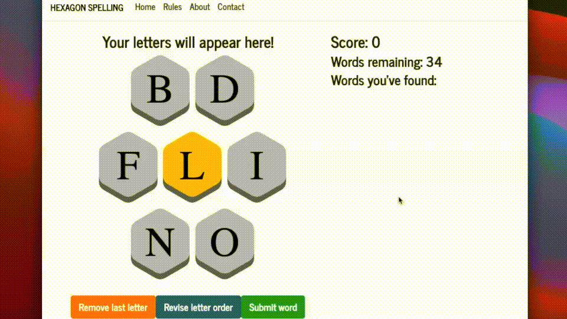
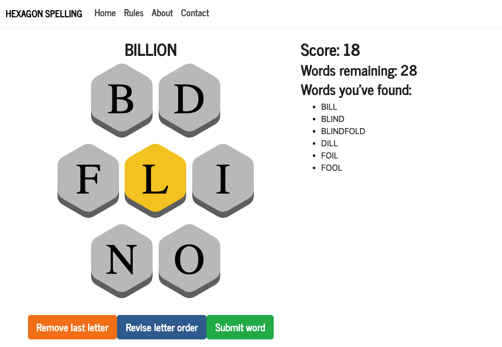
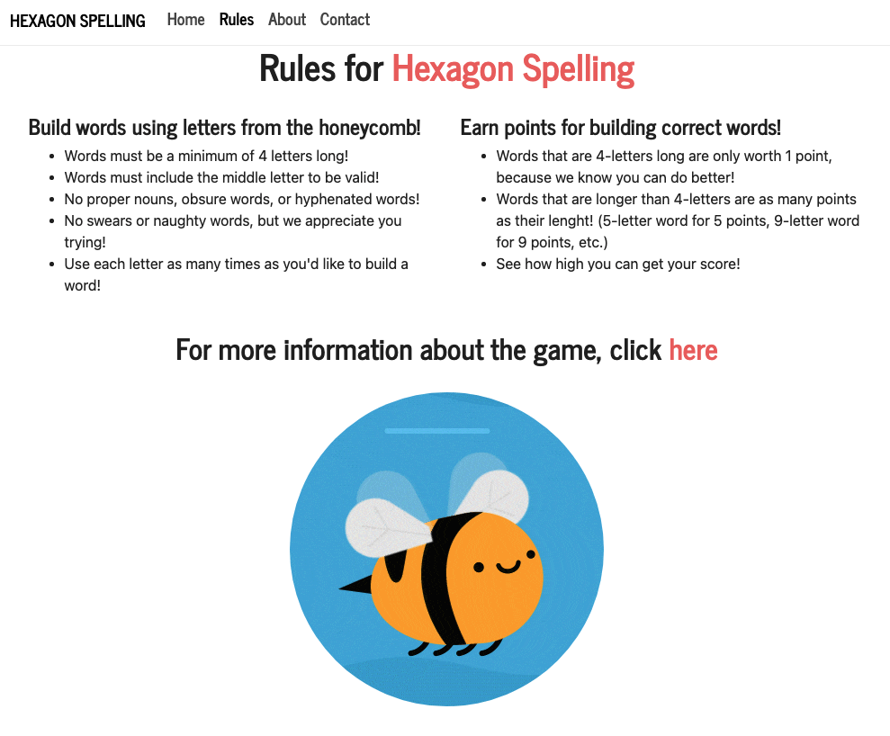
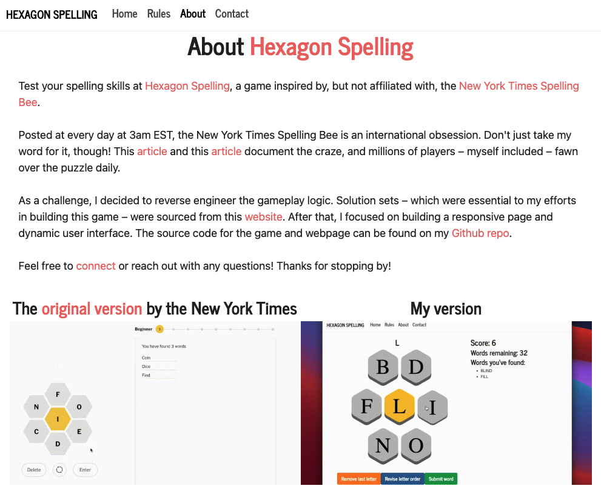

# Hexagon Spelling

## Deployed Website:
## [https://hexagon-spelling.herokuapp.com/](https://hexagon-spelling.herokuapp.com/)

## DESCRIPTION
A game inspired by, but not affiliated with, the New York Times "Spelling Bee": [https://www.nytimes.com/puzzles/spelling-bee](https://www.nytimes.com/puzzles/spelling-bee).

I reverse engineered the gameplay logic and built a responsive page and dynamic user interface.

Hexagon Spelling is a MERN stack application (MongoDB, Express, React, Node) deployed on Heroku.

## SCREENSHOTS

### Gameplay

### Rules

### About

### Contact

## INSTALLATION
- No installation is required, as the user can simply visit the deployed application link: [https://hexagon-spelling.herokuapp.com/](https://hexagon-spelling.herokuapp.com/)
- However, if the user wishes to investigate the code locally, the following steps should be performed:
    - Clone the repo for use on your local machine
    - Use the command line to locate the cloned repo and make it your current directory
    - Type `npm install` in the command line; this will install the necessary node module packages and dependencies

## USAGE
- To run the application locally...
    - Use the command line to locate the cloned repo and make it your current directory
    - Simply type `npm start` in the command line
    - This will open a localhost connection on your default browser, wherein the React application will run
- To run the application online, please vist the deployed link: [https://hexagon-spelling.herokuapp.com/](https://hexagon-spelling.herokuapp.com/)
- Regarding the rules of Hexagon Spelling, please see the rules, located here: [https://hexagon-spelling.herokuapp.com/rules](https://hexagon-spelling.herokuapp.com/rules)
- Happy spelling!

## LICENSE
License: MIT License 
[https://opensource.org/licenses/MIT](https://opensource.org/licenses/MIT)

## CONTRIBUTING
Reverse engineered by yours truly: [https://github.com/JPBrickhouse](https://github.com/JPBrickhouse)

Original game / inspiration: [https://www.nytimes.com/puzzles/spelling-bee](https://www.nytimes.com/puzzles/spelling-bee)

Solution sets – which were essential to my efforts in building the gameplay logic – were sourced from this website: [https://www.shunn.net/bee/](https://www.shunn.net/bee/)